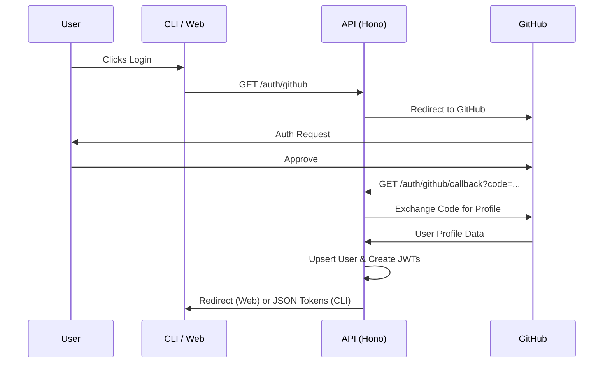

# Insighta Labs+ API (HNG Task 3)

This project is the backend solution for **HNG Task 3**. It is a production-ready, secure API built with **Hono**, **Drizzle ORM**, **Cloudflare D1**, and **Bun**.

## 🚀 Overview

Insighta Labs+ provides a robust platform for profile management with built-in authentication, role-based access control (RBAC), and natural language search capabilities.

### Key Features
- **GitHub OAuth Integration**: Secure authentication flow using GitHub.
- **Session Management**: Dual-token system (Access & Refresh JWTs) with secure cookie storage.
- **Role-Based Access Control (RBAC)**: Fine-grained permissions for `admin` and `analyst` roles.
- **Natural Language Search**: Rule-based engine to interpret conversational queries.
- **Profile Management**: Full CRUD operations for user profiles.
- **Data Export**: Export filtered profile data to CSV format.
- **OpenAPI Documentation**: Interactive API documentation via Scalar.
- **UUID v7**: Time-ordered unique identifiers for efficient database indexing.

---

## 🛠 Architecture

The codebase follows a clean, layered architecture:

- **Routes**: HTTP endpoint definitions and OpenAPI schemas.
- **Controllers**: Request handling and response orchestration.
- **Services**: Core business logic and external API integrations.
- **Repositories**: Database abstraction layer using Drizzle ORM.
- **Middleware**: Authentication, Authorization, and Versioning.
- **Schemas**: Request/Response validation using Zod.

```text
src/
  app.ts              # App entry point & middleware setup
  routes/             # API route definitions
  controllers/        # Request handlers
  services/           # Business logic
  repositories/       # DB queries
  middleware/         # Auth & RBAC logic
  schemas/            # Zod validation schemas
  db/                 # D1 & Drizzle configuration
  types/              # TypeScript definitions
```

---

## 🔐 Authentication & Security

### Authentication & Security

#### OAuth Flow


### RBAC (Roles)
- **Admin**: Can create, update, and delete profiles.
- **Analyst**: Can view and search profiles.

### Security Headers
- CORS enabled with dynamic origin support.
- API Versioning enforced via `X-API-Version: 1` header.
- Rate Limiting: Max 10 requests per window on authentication endpoints.

---

## 📡 API Endpoints

### Authentication
- `GET /auth/github`: Initiate GitHub login.
- `GET /auth/github/callback`: GitHub OAuth callback.
- `POST /auth/refresh`: Refresh expired access tokens.
- `POST /auth/logout`: Invalidate session and clear cookies.
- `GET /auth/whoami`: Get current authenticated user details.

### Users
- `GET /api/users/me`: Current user profile (standard management endpoint).

### Profiles
- `GET /api/profiles`: List profiles with filtering and pagination.
- `GET /api/profiles/search`: Search profiles using natural language.
- `GET /api/profiles/{id}`: Get detailed profile by ID.
- `POST /api/profiles`: Create new profile (**Admin only**).
- `DELETE /api/profiles/{id}`: Remove a profile (**Admin only**).
- `GET /api/profiles/export?format=csv`: Export data to CSV.

---

## 🔎 Natural Language Search

The API supports conversational queries such as:
- *"males from Nigeria above 25"*
- *"young women in Kenya"*
- *"seniors older than 60"*

The engine uses tokenization and regex to map these queries into structured database filters.

---

## ⚙️ Development & Deployment

### Setup
1. `bun install`
2. Configure `.env` based on `.env.example`.
3. `bun run db:migrate` (for local D1 setup).

### Commands
- `bun run dev`: Start local development server.
- `bun run build`: Build for production.
- `bun run deploy`: Deploy to Cloudflare Workers.

### Documentation
- Interactive reference: `/reference`
- OpenAPI JSON Spec: `/doc`

---

## 📝 Technical Requirements (TRD) Compliance

- **Framework**: Hono (Lightweight, Cloudflare optimized).
- **Runtime**: Bun (Fastest TS execution).
- **Storage**: Cloudflare D1 (Serverless SQL).
- **Identity**: GitHub OAuth 2.0.
- **Validation**: Zod (Strict schema enforcement).
- **Versioning**: Header-based (`X-API-Version`).
